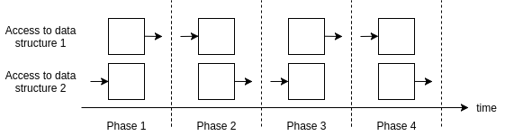
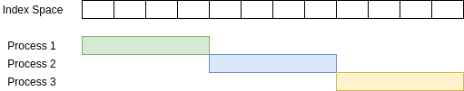
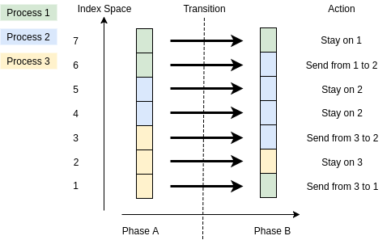

[](https://travis-ci.org/envelope-project/laik)

# A Library for Automatic Data Migration in Parallel Applications

With LAIK, HPC programmers describe their communication needs on
the level of switching among program phases using different
partitionings of global index spaces. For example, the phase sequence
involving two distributed data structure may look like that:



Furthermore, a specification of a partitioning, that is, how indexes
in an abstract index space are assigned to processes, is shown here:



This results in coarse-grained communication triggered at phase
transitions, consisting of simple communication actions, automatically
identified by LAIK:



The application can map the actions on an abstract index space
to adequate communication operations for used data structures
itself, or it can ask LAIK to manage memory attached to indexes.
This way, on a switch between program phases, LAIK executes
the required data communication itself, e.g. using MPI.

Benefits of the LAIK parallel programming model:

* explicit decoupling of the specification of data decomposition
  among parallel tasks from application code specifying the computation.
  This makes it easier to exchange partitioning algorithms or to
  implement dynamic re-partitioning schemes as well as external control.

* programming style becomes agnostic to the number of parallel processes:
  each process works on index ranges as specified in the partitioning
  by LAIK. This makes it easier to support elasticity, ie. dynamically
  shrinking and expanding parallel applications.

* using LAIK data containers can significantly reduce application code
  required for explicit data communication. This makes maintance easier.
  
* the declarative style of programming allows LAIK to trigger communication
  early, enabling it to overlap communication and computation.

While similar parallel programming models exist (Charm++, Legion), LAIK
is designed to make it easy to integrate LAIK functionality step-by-step
into existing legacy HPC code written in C/C++/Fortran. At each incremental
step, the application can be tested for correctness.

If the same phase switches are done repeatedly, the required communication
operations are cached by LAIK, resulting only in a one-time initial cost
to pay for the programming abstraction. Typical HPC applications should trigger
e.g. the exact same MPI calls with LAIK than without, keeping its original
scalability.

# Elasticity for HPC applications

Parallel HPC applications usually are written in a low-level parallel programming model, such as MPI. If computational demands of the application are dynamic, adaptive load balancing has to be implemented by the programmer explictly. The resulting code often is application-specific and quite complex, making future extensions and maintainability tricky. With components used in future HPC systems to become more heterogenous and with variable computational capacity, HPC applications are expected to require load balancing for high scalability.

When HPC applications use LAIK, the library takes over control of the partitioning of data. LAIK is meant for applications written according to the owner-computes rule, where computational demand depends on the size of data partitions given to the processes/threads running in parallel. By controlling partitioning, LAIK provides dynamic load balancing. Furthermore, LAIK provides elasticity. While an application is running, LAIK can remove work load from nodes, allowing them to be taken down for maintainance (e.g. if predicted to fail soon), and it can make use of new resources added on-the-fly.

# The LAIK Programming Model

Programmers have to give LAIK enough information such that it can redistribute data itself. For best performance, applications should have any data locally available that is needed to do the computation for the partition given by LAIK. To this end, applications are split into data access phases, and programmers explicitly specify data dependencies.

LAIK does not directly partition data, but uses *index spaces* as abstraction of data items to work on. While LAIK controls the partitioning of such abstract index spaces, the programmer defines the shape of the index spaces as well as the mapping from indexes to actual data to work on. This way, a change in a partititioning can be seen as two steps. First, the change in the index space results in transition actions defined on indexes: which indexes stay local, which need to be communicated? From this, changes in the actual memory allocation and required communication can be derived.

LAIK controls partitioning in the sense that it triggers a re-run of a partitioning algorithm when required, such as when weights given as input to the partitioning algorithm change, or when processes are removed or added. The partitioning algorithm itself often is application-specific and needs to be provided by the application. Data dependencies are also specified as so-called *derived* partitioning algorithms: e.g. for Jacobi, to update cells within a region, one must have access to the halo of the region. Calculating such extended regions is the job of an partitioning algorithm given by the programmer.

  
# Example

LAIK uses SPMD (single program multiple data) programming style similar to MPI.
For the following simple example, a parallel vector sum, LAIK's communication
funtionality via repartitioning is enough. This example also shows the use of a simple LAIK data container which enables automatic data migration when switching partitioning.

```C
    #include "laik-backend-mpi.h"

    int main(int argc, char* argv[])
    {
        // use provided MPI backend, let LAIK do MPI_Init
        Laik_Instance* inst = laik_init_mpi(&argc, &argv);
        Laik_Group* world = laik_world(inst);

        // global 1d double array: 1 mio entries, equal sized blocks
        Laik_Data* a = laik_new_data_1d(world, laik_Double, 1000000);
        // parallel initialization: write 1.0 to own partition
        laik_fill_double(a, 1.0);

        // partial vector sum over own partition via direct access
        double mysum = 0.0, *base;
        uint64_t count, i;
        // map own partition to local memory space
        // (using 1d identity mapping from indexes to addresses, from <base>)
        laik_map_def1(a, (void**) &base, &count);
        for (i = 0; i < count; i++) mysum += base[i];

        // for collecting partial sums at master, we can use LAIK's data
        // aggregation functionality when switching to new partitioning
        Laik_Data* sum = laik_new_data_1d(world, laik_Double, 1);
        laik_switchto_new(sum, laik_All, LAIK_DF_CopyOut);
        // write partial sum
        laik_fill_double(sum, mysum);
        // master-only partitioning: add partial values to be read at master
        laik_switchto_new(sum, laik_Master, LAIK_DF_CopyIn | LAIK_DF_Sum);

        if (laik_myid(world) == 0) {
            laik_map_def1(sum, (void**) &base, &count);
            printf("Result: %f\n", base[0]);
        }
        laik_finalize(inst);
    }
```
Compile:
```
    cc vectorsum.c -o vectorsum -llaik
```
To run this example (could use vectorsum directly for OpenMP backend):
```
    mpirun -np 4 ./vectorsum
```

# Build and Install

There is a 'configure' command that detects features of your system and enables corresponding LAIK functionality if found:
* for MPI backend support, MPI must be installed
* for external control via MQTT, mosquitto and protobuf must be installed

To compile, run

    ./configure
    make

There also are clean, install, and uninstall targets. The install defaults
to '/usr/local'. To set the installation path to your home directory, use

    PREFIX=~ ./configure

## Installing the dependencies on Debian/Ubuntu

On Debian/Ubuntu, installing the following packages will allow you to configure
and build LAIK with minimal features enabled:

    gcc
    make
    python

As communication backend, we currently focus on MPI. To enable MPI support,
install an MPI library such as MPICH or OpenMPI. For OpenMPI, you need

    libopenmpi-dev
    openmpi-bin

Additionally installing the following packages will allow building with all
optional features and examples enabled:

    g++
    libmosquitto-dev
    libpapi-dev
    libprotobuf-c-dev
    protobuf-c-compiler

Mosquitto and protobuf will enable external agents, and PAPI allows
to use performance counters for profiling. C++ is used in some examples.


# License

LGPLv3+, (c) LRR/TUM
