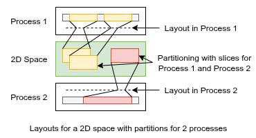

# Layouts

## Purpose

Layouts specify how process-local partitions of LAIK
containers are mapped to local memory resources.



LAIK users may want to choose whatever layout
fits for an application. LAIK layouts are a way for
users to inform LAIK about the chosen ordering in
memory, for LAIK to be able to trigger required communication.

Given the ranges in the index space assigned to a
process by a partitioning algorithm, layouts specify
  * how many blocks of memory are used,
  * block sizes by means of the number of indexes
    contained in each block, and
  * how global indexes in assigned ranges are mapped to
    offsets in the blocks

The same layout can be used for multiple LAIK containers.
A layout is independent from how the allocation of
required memory resources is done. Either LAIK can do
the allocation required, or application developers
may tell LAIK about memory resources to use.


## Requirements

* R1: LAIK users should be able to specify arbitrary layouts,
  especially irregular layouts (where the ordering can be
  calculated on the fly, or the order is stored in an array
  in the application)

* R2: Applications may want to maintain shadow copies of values
  for faster access in algorithms. LAIK can support this by
  partitioner algorithms providing overlapping ranges assigned
  to a process, and layouts mapping the same global index within
  different ranges to different points in local memory.
  The design for layouts should not prohibit this possibility.

* R3: memory requirements for multiple partitionings at once should
  be supported by layouts (with same unique mapping of a global
  index to a memory address independent of the current partitioning
  used). This avoids re-allocation and copy operations, as well as
  the need to re-query for addresses of indexes when switching
  between partitionings.

* R4: when switching to a new partitioning with changed local
  partitions, it should be possible to reuse allocations
  used before. Thus, creating a new layout should take the old
  layout into account to keep allocation requirements similar.


## Design

* For flexibility, layout policy is specified by a layout
  object providing functions to query the ordering (R1).
  The alternative would be support for (regular) layout patterns,
  which does not seem to be flexible enough.

* LAIK users can specify their own layout factory function
  which is called by LAIK to create custom layouts, allowing
  interface functions written by the user (R1).

* the possiblity to specify multiple memory blocks in a layout
  can result in less re-allocations and copy operations required
  which switching to a new partitioning

* layouts are subdiveded into sections, which can use their own
  mapping pattern. Within a section, global indexes are uniquely
  mapped to (at most) one point in memory. This fulfills R2, by
  putting overlapping ranges from a partitioner algorithm into
  different layout sections.


## Implementation

### Interface of layout objects

A custom layout interface definition does not have to provide
an implementation for all functions. However, full implementation
provides higher customability and may enable higher performance.

```C
int64_t map_count(Laik_Layout* l)
```
Number of allocations required to cover the layout.
Optional, defaults to 1. 

```C
int64_t map_size(Laik_Layout* l, int map)
```
Size of allocation `map`, 0 <= `map` < `map_count()`, given
as number of unique indexes covered by this allocation. Required. 

```C
int64_t section_count(Laik_Layout* l)
```
Number of sections.
Optional, defaults to 1. 

```C
int64_t map(Laik_Layout* l, int section)
```
Returns id of allocation which covers a section.
Optional. Defaults to identidy, ie. each section covered by
a separate allocation.

```C
int64_t offset(Laik_Layout* l, int section, Laik_Index* idx)
```
Returns offset of global index `idx` in the allocation
which covers the given section of the layout.
Returns -1 if index is not contained in the section.
Required.

## Layout Presets

### Lexicographical Layout

Lexicographical layout, with separate allocations/sections
for ranges with different tags.

## Link to Source

* data.h: declaration of layout interface, layout factory
* layout.c: default definitions of functions from layout interface
* layout-lex.c: implementation of lexicographical layout
